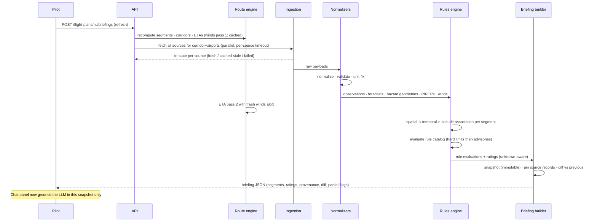

# Route-Aware GA Weather Decision Support — Technical & Product Plan

Status: **PLANNING — for review. No application code written.**
Date: 2026-07-18 · Repo: `codynguyen18/aviation-weather` · Branch: `claude/aviation-weather-route-planner-2r6xqz`

---

## 1. Executive Summary

This plan proposes a **single-deployment Next.js + TypeScript application with PostgreSQL/PostGIS as both system of record and geometry engine**, delivering route-aware GA weather decision support for CONUS cross-country flights. The design splits responsibilities exactly as your brief requires: **deterministic software** computes route geometry (great-circle legs — explicitly not ATC routing), geodesically buffered corridors, wind-adjusted ETAs with correct time-zone/twilight handling, weather retrieval and normalization, spatial/temporal/altitude hazard association, and a versioned declarative rules engine producing green/yellow/red/**unknown** segment ratings with full provenance. The **LLM** (provider-agnostic, Claude default) sits at the edge: it receives an immutable, compact briefing snapshot, answers through read-only tools, must cite source IDs, and every reply passes a deterministic post-generation validator that rejects uncited claims, numeric drift, and prohibited language before the pilot sees it.

Key verified findings from primary-source research (live-tested during planning, §7): the AWC Data API and api.weather.gov cover every MVP product without authentication or fees, but with politeness expectations that dictate server-side fetching and caching; hazard products arrive with usable GeoJSON geometry and altitude bounds; winds-aloft is station-based fixed-format text requiring careful decoding; radar/satellite are best treated as display-only tile layers.

Deliberate MVP restraint: no Redis, no job queue, no Python service, no microservices — each has a designed seam for later (pg-boss for auto-refresh; a Python ingestion worker at the `SourceAdapter` seam if HRRR/NEXRAD lands). Unknown never collapses to green; missing or stale data is loud in the UI, the rules, and the LLM context. The build is organized into 10 reviewable milestones (~10–14 solo-dev weeks), starting with a scaffold + fixture-first development so everything is testable offline. The plan ends with 10 decisions needing your approval before implementation begins.

## 2. Current Repository Findings

The repository is **empty**: a bare git initialization with zero commits, zero files, and no remote branches. There is no prior code, tooling, license, or documentation to preserve or conform to. Every technology decision in this plan is therefore unconstrained by legacy, and the "unless the repository already supports them cleanly" deferrals all resolve to *deferred*.

## 3. Assumptions & Open Questions

### Labeled assumptions (each reversible; flag any that are wrong)

- **A1 — Team size**: built by one developer (you) part-time, possibly with AI-assisted implementation; milestone sizing assumes this.
- **A2 — Audience**: private hobby/beta tool for a small pilot group initially (≤ ~50 users), not a commercial launch; informs infra sizing and the legal-review timing (before *public* availability, not before first deploy).
- **A3 — LLM provider**: Anthropic Claude as default behind a provider-agnostic adapter (you can veto — §23).
- **A4 — Budget**: ~$25–75/month infra + LLM usage is acceptable at MVP.
- **A5 — Winds-aloft ETAs**: MVP uses FB winds for groundspeed adjustment (it's in your MVP list); zero-wind fallback is flagged, not silent.
- **A6 — Navdata**: OurAirports bootstrap in M1, FAA NASR importer lands before public use (fixes/navaids need NASR regardless).
- **A7 — "Saved routes" means saved *plans*** (route + settings), not a route library shared between users.
- **A8 — English-only UI; CONUS only** (per brief).
- **A9 — Radar/satellite are display-only map layers in MVP** (no ingestion into rules), consistent with your deferral of NEXRAD processing; rules never consume radar.
- **A10 — Terrain data**: MVP terrain/ridge-clearance rule uses a coarse CONUS max-elevation grid (e.g., GMTED/SRTM-derived tiles precomputed offline) rather than full terrain profiling; full terrain analysis is post-MVP.

### Open questions (need your input, gathered in §23)

1. Confirm LLM provider + model tier and monthly spend cap.
2. Auth: magic-link email OK, or do you want Google OAuth only?
3. Deploy target preference (Fly.io vs Railway vs VPS)?
4. Corridor default ±25 nm and PIREP band ±4,000 ft — match your instincts?
5. Is a paper/legal review planned before opening beyond personal use?
6. Should alternate-route comparison make MVP (currently yes, as linked plans) or slip to post-MVP?
7. NASR licensing is public domain; OK to ship OurAirports (ODbL-ish/public domain mix) attribution in footer?

## 4. Proposed MVP Definition & Explicit Non-Goals

### MVP (matches your list, with precision added)

Route entry (airports/fixes/lat-lon, direct legs) → segmented corridor route → wind-adjusted ETAs w/ tz+twilight → retrieval+normalization of METAR, TAF, PIREP, SIGMET, Conv SIGMET, G-AIRMET, CWA, FB winds, AFD (+ SPC outlook as context layer, NWS alerts for airports) → deterministic rules vs personal minimums → green/yellow/red/**unknown** per segment with provenance → immutable briefing snapshots + What-Changed diff → grounded chat with citation validation → manual refresh → saved aircraft/minimums/plans. Radar+satellite as display-only map layers (timestamped) since they're low-cost overlays of high pilot value — but **no rule consumes them** (A9).

### Explicit non-goals for v1 (deferred; none are supported by the empty repo)

Raw HRRR/model ingestion · NEXRAD Level II/III processing · tactical thunderstorm routing · calibrated completion probabilities · airway/ATC-preferred routing · mobile-native apps · in-flight/EFB use · official-briefing status or flight-plan filing · international coverage · automatic background refresh (manual-only at MVP; architecture leaves the seam) · multi-user route sharing · fuel-price optimization.

# 5. System Architecture

## 5.1 Architectural options compared

Three candidate shapes were evaluated (each argued by an independent design pass; synthesis below):

| | **A. Next.js/TS monolith, PostGIS as geometry engine** | **B. Next.js frontend + Python FastAPI backend** | **C. Minimal-ops variant of A** |
|---|---|---|---|
| Geospatial quality | GEOS-grade via PostGIS SQL (geodesic buffers, intersections) | Shapely/pyproj — excellent, in-process | same as A |
| Language surfaces | 1 (TS end-to-end, shared Zod types) | 2 (TS + Python, OpenAPI codegen seam) | 1 |
| Rules engine | TS, typed against briefing schema | Python, Pydantic | TS |
| Deploy units | 1 container + managed PG | 2 containers + managed PG | 1 |
| Dev loop (solo dev) | fastest | context-switching + codegen churn | fastest |
| Post-MVP HRRR/NEXRAD path | add Python *worker* later at ingestion seam | already Python | same as A |
| Main risk | JS geospatial ecosystem weakness — mitigated by doing geometry in PostGIS, not JS | accidental microservices; two schemas drifting | Postgres-only caching could need Redis later (acceptable seam) |

**Recommendation: A/C — a single Next.js + TypeScript application with PostgreSQL/PostGIS doing all nontrivial geometry, no Redis, no queue, no Python service at MVP.** (Panel outcome: two of the three independent passes recommended the TS monolith outright; the Python-hybrid pass itself conceded PostGIS covers most of the MVP geometry and that its strongest argument — the GRIB2/xarray ecosystem for HRRR — applies only to explicitly deferred features. It also made one point we adopt as a standing constraint: *if* Python ever enters, it must be either the whole backend or an internal batch worker — never a "compute sidecar" behind Next.js API routes, which is the accidental-microservices trap. The ops pass suggested even deferring PostGIS; we decline that one because corridor×hazard-polygon intersection is core MVP behavior, not a future need — but we adopt its caching/deployment guidance below.)

Rationale: the genuinely hard geospatial operations (geodesic corridor buffering, polygon intersection, proximity search) are exactly what PostGIS does natively and correctly; pushing them into SQL removes the strongest argument for Python without importing Turf.js's planar-math pitfalls. Everything else (parsing, rules, ETA math) is plain typed logic where a single language + one Zod-validated schema family from DB to UI to LLM context is a large correctness and velocity win for a solo developer. The Python seam is *planned but not built*: weather ingestion is isolated behind a `SourceAdapter` interface, so a future HRRR/NEXRAD worker (Python, reading/writing the same Postgres) attaches at that seam without refactoring — that is where FastAPI/Shapely would sit *if and when* raw-model ingestion lands (post-MVP), as an internal worker, not a user-facing service.

Deliberately deferred infrastructure: **Redis** (in-process LRU + Postgres cache tables cover caching/rate-limiting at MVP scale; politeness to government APIs is enforced by our own fetch coordinator regardless — see the fetch policy in §7.8: cache keyed by product+station, request coalescing, SWR TTLs derived from live-verified upstream cache headers), **background job system** (manual refresh only in MVP; nightly maintenance via GitHub Actions cron; pg-boss — Postgres-backed, no new infra — is the designated upgrade when auto-refresh arrives), **microservices** (none). One hosting constraint follows from this design: the app runs as a **long-lived Node server** (Docker on Railway/Render/Fly), *not* serverless — serverless would kill the in-process cache, request coalescing, and SSE streaming that the MVP relies on.

## 5.2 Stack

- **Next.js (App Router) + TypeScript**, React 19, Tailwind + shadcn/ui
- **MapLibre GL JS** (vector base tiles from a free provider e.g. OpenFreeMap/Protomaps; GeoJSON overlays; raster radar/satellite tiles) — chosen over Leaflet for smooth vector rendering, layer control, and long-term room (deck.gl interop) at similar effort
- **PostgreSQL 16 + PostGIS 3.4** — system of record, geometry engine, cache store, rate-limit store
- **Drizzle ORM** + raw SQL for spatial (Drizzle over Prisma: first-class SQL escape hatch, lighter runtime; Prisma acceptable if you prefer its migrations — flagged in §23)
- **Zod** schemas shared by route handlers, briefing objects, rule definitions, LLM context builder
- **LLM**: provider-agnostic adapter (thin: `complete(messages, tools, schema)`), Anthropic Claude default (A3), Vercel AI SDK as implementation shortcut with our own grounding/validation wrapper
- **Auth.js**, **pino** logging, **OpenTelemetry** metrics
- **Docker Compose** local; single-container deploy on Fly.io/Railway (§19)

## 5.3 Architecture diagram

```mermaid
flowchart LR
  subgraph Browser
    UI[React dashboard\nMapLibre map · timeline · chat]
  end
  subgraph NextJS[Next.js app — single deploy unit]
    API[Route handlers\nZod-validated JSON + SSE]
    RTE[Route & time engine]
    ING[Weather ingestion\nSourceAdapters + fetch coordinator\npoliteness · retry · circuit breaker]
    NORM[Normalizers\nMETAR/TAF/PIREP/hazards/winds]
    RULES[Rules engine\nversioned declarative catalog]
    BRIEF[Briefing builder\nsnapshots · diffs · provenance]
    LLMW[LLM orchestrator\ncontext builder · read-only tools\ncitation validator]
  end
  subgraph PG[(PostgreSQL + PostGIS)]
    GEO[geometry: routes · corridors · hazards]
    CACHE[source_records cache]
    SNAP[briefings · evaluations · conversations]
  end
  subgraph Upstream[Government sources]
    AWC[aviationweather.gov Data API]
    NWS[api.weather.gov]
    SPC[SPC outlooks]
    NASR[FAA NASR navdata cycle]
    TILES[radar/satellite tile servers]
  end
  LLMP[LLM provider API]

  UI -->|HTTPS JSON/SSE| API
  UI -->|raster tiles direct| TILES
  API --> RTE --> GEO
  API --> BRIEF
  BRIEF --> RULES --> GEO
  ING --> AWC & NWS & SPC
  ING --> CACHE --> NORM --> GEO & SNAP
  NASR -->|28-day import job| GEO
  BRIEF --> SNAP
  LLMW --> LLMP
  API --> LLMW --> SNAP
```

## 5.4 Data-flow: briefing generation



## 5.5 Component breakdown

| Component | Responsibility | Key interfaces |
|---|---|---|
| `nav/` resolver | ident → waypoint (NASR/OurAirports snapshot) | `resolve(ident) → Waypoint \| Ambiguity[]` |
| `route/` engine | legs, segmentation, corridors, ETAs, tz, twilight | `buildRoute(plan) → RouteModel`, `computeTimes(route, perf, winds)` |
| `ingest/` adapters | one `SourceAdapter` per upstream; fetch coordinator owns politeness, caching, circuit breaking | `fetch(scope) → SourceRecord[]` (tri-state) |
| `normalize/` | product-specific parsers → canonical shapes | pure functions, fixture-tested |
| `rules/` | catalog + evaluator + aggregation | `evaluate(snapshotCtx) → RuleEvaluation[]` |
| `briefing/` | snapshot assembly, provenance pinning, diffs | `generate(planId) → Snapshot`, `diff(a,b)` |
| `llm/` | context builder, adapter, tools, validator | `chat(snapshot, history, msg) → ValidatedReply` |
| `web/` | screens & components (§15) | briefing JSON, GeoJSON |

# 6. Weather Data Sources — Selection & Rationale

All facts in §6–7 were verified against primary documentation **and live-tested with real HTTP requests on 2026-07-18** (a research pass followed by an independent adversarial re-verification pass; discrepancies between docs and live behavior are called out explicitly). Confidence labels: **live** = endpoint exercised and headers/fields observed; **docs** = primary docs only.

MVP source selection:

| Need | Chosen source | Why |
|---|---|---|
| METAR, TAF | AWC Data API `/api/data/metar`, `/taf` | decoded JSON, free, no auth; NWS obs endpoint rejected as METAR source (live-verified: 5-min MADIS obs frequently have empty `rawMessage`, gaps of 2+ h in raw METARs) |
| PIREP/AIREP | AWC `/api/data/pirep` | decoded turbulence/icing structure; bbox query |
| SIGMET + Convective SIGMET | AWC `/api/data/airsigmet` (one endpoint; `hazard` field distinguishes) | GeoJSON polygons w/ altitude fields |
| G-AIRMET | AWC `/api/data/gairmet` | GeoJSON, 3-h snapshots F00–F12 |
| CWA | AWC `/api/data/cwa` | GeoJSON polygons |
| Winds/temps aloft | AWC `/api/data/windtemp` (FB winds) | only structured official option; text/plain fixed-width — we write the parser |
| AFD | NWS API `/products/types/AFD/locations/{wfo}` | full text incl. `.AVIATION` section |
| NWS alerts | NWS API `/alerts/active` | point/area filters, GeoJSON |
| Point/grid forecasts | NWS API `/points` → `/gridpoints` | airport-context enrichment (sky cover, `probabilityOfThunder` in raw grid) |
| SPC outlooks | `spc.noaa.gov` `day{1,2,3}otlk_*.lyr.geojson` | context layer only, never sole red |
| Radar overlay | NWS opengeo GeoServer WMS (official, 2-min frames) primary; nowCOAST WMS (4-min, ~7 h loop, CloudFront) fallback; IEM XYZ tiles as documented non-federal alternate | display-only in MVP |
| Satellite overlay | nowCOAST GOES WMS (`goes_longwave_imagery`) | mercator + CORS `*`, works day/night |
| Lightning | **deferred** — GLM via NOAA NODD S3 is the only free redistribution-safe option and needs server-side netCDF processing; NLDN/ENTLN are commercial | convective products carry MVP |
| Airports/fixes/navaids | OurAirports CSV bootstrap (M1) → FAA NASR 28-day CSV (authoritative) | NASR needed for fixes, runways, magvar |
| Sunrise/twilight | computed locally (`suncalc`; NOAA solar equations) | free, offline, sub-2-min accuracy; USNO API kept as test oracle |
| GFA | not ingested — no API endpoint exists (verified: 0 `gfa` paths in AWC OpenAPI spec); AWC's own GFA page composes the same layers we ingest; static PNGs offered as optional chart links | |

# 7. External API Integration Matrix

### 7.1 AWC Data API (aviationweather.gov) — METAR · TAF · PIREP · SIGMET/Conv SIGMET · G-AIRMET · CWA · winds aloft · station/airport info — **[live]**

| Property | Verified value |
|---|---|
| Endpoints | `GET /api/data/{metar,taf,pirep,airsigmet,isigmet,gairmet,cwa,windtemp,stationinfo,airport}`; params per product (`ids`/`@ST`/`bbox`, `format`, METAR `hours`/`taf`, PIREP `age`/`level`/`inten`/`id+distance`, gairmet `product`/`hazard`/`fore=0|3|6|9|12`, windtemp `region`/`level`/`fcst=06|12|24`, `date` for history) |
| Auth | none; custom **User-Agent requested** by docs |
| Rate limits | **100 req/min hard (temporary block)**; courtesy "≤1 req/min per thread per endpoint"; ~400-entry response cap; **no rate-limit or Retry-After headers exist** — client must self-throttle blind; bulk cache files (`/data/cache/*.cache.*.gz`) rebuilt ~1/min (live-measured) are the sanctioned high-volume path |
| CORS | **disabled** ("not permitted at this time", confirmed live — no ACAO on GET or OPTIONS) → all fetches server-side |
| Formats | raw/decoded/json/geojson/xml(/iwxxm) varying by product; **CWA: raw/json/geojson only (xml→400)**; windtemp: **text/plain only** (format param silently ignored) |
| Cadence | METAR ~hourly+SPECI (response `Cache-Control: max-age=60`); TAF 4×daily+amendments (60 s); PIREP continuous (30 s); Conv SIGMET hourly H+55; G-AIRMET issued 4×daily, 3-h snapshots; CWA event-driven ≤2 h; windtemp 4×daily (max-age=180); stationinfo 300 s / airport 180 s |
| Latency | 0.2–1.0 s observed |
| Coverage | worldwide; full CONUS |
| Retention | docs say 15 days; **live-verified 30 days** via `date` (400 beyond); windtemp latest-only; treat 15 d as the guaranteed floor |
| Reliability | NWS production, Azure Front Door CDN; but `x-cache: CONFIG_NOCACHE` observed on some endpoints — assume the CDN does **not** absorb our traffic |
| Caching | server-side caching expected/encouraged; honor observed TTLs (30–300 s per product) |
| Attribution | US Gov public domain; no endorsement implication |

**Live-verified integration gotchas (each becomes a normalizer test):**
- `format=json` returns **epoch-seconds** timestamps; `format=geojson` returns ISO strings — normalize at ingest.
- **Altitude unit traps**: G-AIRMET `base`/`top` are *strings in hundreds of feet* (`"090"`, `"SFC"`); airsigmet/isigmet/cwa altitudes are integer feet; GeoJSON METAR cloud bases are hundreds of feet while JSON METAR bases are feet.
- Convective SIGMET `validTimeTo` in JSON/GeoJSON is **truncated to the next hourly issuance** (e.g. 02:55→03:54:59Z) while raw text says "VALID UNTIL 0455Z" — use raw validity for the conservative window; Conv SIGMET **OUTLOOK** polygons exist only in `rawAirSigmet` text (FROM-lines), not as GeoJSON.
- PIREP `icaoId` can be the collecting center (observed `KWBC` on a Nebraska PIREP) — join geographically by lat/lon only.
- Empty results: HTTP **204** (live-verified) except GeoJSON → 200 + empty FeatureCollection (documented).
- G-AIRMET live field names (`forecast`, `dueTo`) contradict the OpenAPI spec (`forecastHour`, `due_to`) — code to live; `date` works on `/airsigmet` despite being absent from its spec entry (could disappear).
- `/api/data/airport` `elev` is **meters** (undocumented); NASR elevations are feet; several numerics arrive as strings.
- windtemp FB decoding: `9900`=light&variable; coded dir>36 → dir−50 & speed+100; high-elevation stations omit low levels (blank fixed-width columns); pin `region`/`level`/`fcst` explicitly.
- The spec also exposes `/api/data/{navaid,fix,feature,obstacle}` — useful cross-checks for the navdata importer.

### 7.2 NWS API (api.weather.gov) — alerts · points/gridpoints · AFD products · station obs — **[live]**

| Property | Verified value |
|---|---|
| Endpoints | `/alerts/active?point=lat,lon|area=ST`; `/points/{lat},{lon}` → `/gridpoints/{wfo}/{x},{y}[/forecast[/hourly]]`; `/products/types/AFD/locations/{wfo}/latest`; `/stations/{id}/observations` |
| Auth | none, but **User-Agent required** — empty UA → **403 Akamai HTML** (not JSON) |
| Rate limits | intentionally undisclosed; rate-limit response is **also a 403 Akamai HTML page with a Reference #** (officially confirmed, indistinguishable from missing-UA) that typically clears in ~5 s; docs explicitly warn "**proxies are more likely to reach the limit**" — directly relevant to our server-side design: cache hard, coalesce requests |
| CORS | open (`access-control-allow-origin: *` observed) — but we proxy anyway for caching |
| Formats | GeoJSON default; JSON-LD, CAP/ATOM (alerts) via Accept; products are JSON-LD only |
| Cadence | alerts effectively real-time (**server TTL 5 s**); gridpoints per-WFO (≥2×daily + amendments; surface `updateTime`, don't assume); AFD ≥2×daily per office (live-observed 2/day for REV); obs 5-min MADIS w/ up to 20-min QC delay |
| Latency | sub-second; alert freshness ≤5 s |
| Coverage | US + territories |
| Retention | alerts 7 days (`start`/`end` archive params live-verified); AFD ~7 days (14 products observed); obs ~7 days rolling (live-verified by bisection); forecasts forward-only (~7.3-day grid) |
| Reliability | Akamai-fronted, solid; **no cache-busting params** (400 on unknown query params — documented and live-verified) |
| Caching | explicit `Cache-Control` on everything (points ~1 day, forecast 1 h, AFD 60–120 s, alerts 5 s) — mirror these TTLs server-side |
| Attribution | US Gov public domain |

**Gotchas:** raw gridpoint aviation elements (`skyCover`, `ceilingHeight`, `visibility`, `probabilityOfThunder`) use SI units (wind **km/h**), ISO-8601 *duration-encoded* validity spans (`PT1H`, `P1DT17H` — parser must expand), and sentinel values (`ceilingHeight: -30.48` m observed on clear sky — range-check before use). Tornado-watch alerts lack SPC SEL language (documented). AFD `productText` needs a `.SECTION.../&&` parser; map route → WFOs via `/points` sampling. The obs endpoint is a *backup only* (empty `rawMessage` problem above).

### 7.3 SPC convective outlooks (spc.noaa.gov) — **[live]**

Day 1/2/3 GeoJSON: `https://www.spc.noaa.gov/products/outlook/day{1,2,3}otlk_cat.lyr.geojson`, hazard probabilistics `day{1,2}otlk_{torn,wind,hail}`, significant-severe `cig{torn,wind,hail}`; Day 3 combined `day3otlk_prob`. No auth; CloudFront (Age header, `max-age=120` effective); shapefile/KMZ/ArcGIS REST also available (ArcGIS REST reflects Origin — browser-viable). Issuance: Day 1 at 0600/1300/1630/2000/0100Z; Day 2 ~0730Z(1 AM CST)/1730Z; Day 3 ~0830Z(2:30 AM CST)/1930Z. Properties: `DN` (categorical 2=TSTM…8=HIGH; probabilistic = integer %), `VALID/EXPIRE/ISSUE` + `_ISO` variants, `LABEL`, fill colors. Retention: latest overwritten; yearly archives (GeoJSON back to ~2019–2020, shapefiles further). Public domain.
**Trap (live-verified): several plausible-looking URLs return HTTP 200 with silently frozen data** — `sig{torn,wind,hail}` stale since 2026-03-03, `day2otlk_prob` frozen at 2020-01-30. *Always validate `last-modified`/`ISSUE` against expected issuance schedule* — this is a concrete case for our `source-stale` rule and freshness monitors.
Remaining matrix fields: auth none; rate limits none documented, none observed (standard NWS politeness applies; we fetch each outlook once per issuance server-side); latency sub-second via CloudFront edge (`Age` header observed); coverage CONUS (SPC's forecast domain); reliability high (static files on CloudFront) apart from the frozen-URL trap; CORS on the primary GeoJSON URLs not relied upon — we ingest server-side (the ArcGIS REST alternative reflects Origin and is browser-viable if ever needed).

### 7.4 Radar & satellite overlays — **[live]**

| Source | Type | CORS | Cadence / window | Role |
|---|---|---|---|---|
| NWS opengeo GeoServer `conus_bref_qcd`/`conus_cref_qcd` (official) | WMS 1.3.0, EPSG:3857, WMS-T time param | `*` | 2-min frames, ~2 h window | **primary radar layer** (MapLibre raster source with `{bbox-epsg-3857}` template — live-verified; WMTS is 403) |
| nowCOAST `weather_radar` WMS (official, CloudFront) | WMS 1.3.0 + time | `*` | 4-min frames, ~7 h window | fallback / longer animation loops |
| IEM NEXRAD `nexrad-n0q-900913/{z}/{x}/{y}.png` (**non-federal**, Iowa State) | true XYZ tiles + `-m05m…-m55m` history | `*` | 5-min, 55-min loop | documented alternate; must be labeled non-federal |
| nowCOAST `satellite` WMS `goes_longwave_imagery` etc. (official) | WMS 1.3.0 + time | `*` | 5-min (GOES ABI CONUS) | **satellite layer** |
| NESDIS STAR CDN GOES imagery | fixed-grid JPEG sectors (CC0 marker verified) | `*` | 5-min | not map-overlayable (projection mismatch); optional imagery panel |
| MRMS GRIB2 (`mrms.ncep.noaa.gov`) | raw data | none | ~2-min | post-MVP only (self-rendered tiles) |

All public domain; credit NOAA/NWS (and Iowa State if IEM used). Auth: none on any of these services. Rate limits: none documented and none observed on any (NOAA publishes contacts — `nws.mapservices@noaa.gov` — for high-volume use); browser tile loads at MVP user counts are far below any plausible threshold, but layer code still throttles animation frame prefetch. Latency: tiles returned sub-second; product latency ≈ frame cadence + a few minutes (nowCOAST observed ~8 min behind newest MRMS frame). Reliability: opengeo is a single-origin GeoServer with no CDN (most current data, least burst capacity); nowCOAST and IEM sit behind CloudFront/Fastly (absorb load better); the layer registry defines fallback order opengeo → nowCOAST → IEM, and a layer whose newest frame exceeds 2× cadence shows a staleness chip. Tiles load **directly in the browser** (CORS open) with our attribution + product-time chip; no proxying cost. Each layer's frame time comes from WMS capabilities/metadata, never wall clock.

### 7.5 Lightning — **[live/docs]**

Free & redistribution-safe: **GOES GLM only** — NODD S3 netCDF every 20 s (no CORS; server-side processing required; full mission archive) or STAR CDN flash-extent-density imagery (5-min, fixed-grid projection). NLDN (Vaisala)/ENTLN are commercial; NCEI free products are historical daily summaries only (restriction language re-verified). **MVP: no lightning layer**; convective SIGMETs/CWAs/SPC carry the hazard signal. Post-MVP: GLM S3 poller → GeoJSON flashes.

### 7.6 Airport & navigation metadata — **[live]**

| Property | FAA NASR 28-day subscription | OurAirports |
|---|---|---|
| Endpoint | `nfdc.faa.gov/webContent/28DaySub/extra/{DD_Mon_YYYY}_CSV.zip` (combined ~22 MB; per-category e.g. `_APT_CSV.zip`; next-cycle preview posted early) | `davidmegginson.github.io/ourairports-data/{airports,runways,navaids,airport-frequencies}.csv` |
| Contents | authoritative: airports (`APT_BASE` incl. lat/lon/elev ft/magvar), runways (`APT_RWY`: length/width/surface), navaids, **fixes** (`FIX_BASE`), obstacles | worldwide airports/runways/navaids; crowdsourced |
| Cadence | 28-day AIRAC cycle (current 2026-07-09; next 2026-08-06 — both live-verified) | daily dump |
| Quirks | **HEAD → 503** (use GET; Range GETs work); `no-cache` headers — mirror once per cycle; **format change lands with the 2026-09-03 cycle (26-01 NASR DPN)** — build the parser against the shipped `*_CSV_DATA_STRUCTURE.csv` schema files; archives back to 2022 verified | row order shifts daily; US small fields often in `gps_code` with blank `icao_code`; ODbL-free (Unlicense, re-verified) |
| License | US Gov public domain (17 USC §105; no on-page statement) | public domain (Unlicense) |
| Role | authoritative store from M1+ (fixes required for waypoint entry) | day-1 bootstrap + name autocomplete |

AWC `/api/data/airport` + `/stationinfo` serve as cross-checks (elev-meters trap noted in §7.1; `stationinfo.siteType[]` tells which stations issue TAFs — useful for "nearest TAF" logic).

### 7.7 Sunrise/twilight — **[live]**

**Compute locally** with NOAA solar equations (`suncalc`, BSD-2) — deterministic, free, no rate limits, ±1–2 min accuracy (ample for a civil-twilight rule with a 30-min advisory buffer). USNO API (`aa.usno.navy.mil/api/rstt/oneday`, CORS `*`, no auth, public domain, whole-minute Air-Almanac-grade times) is the **test oracle** for our implementation. sunrise-sunset.org rejected for production (attribution required, unspecified limits, per-point external calls).

### 7.8 Cross-cutting fetch policy (derived from verified limits)

One **fetch coordinator** owns all upstream traffic: per-host token buckets (AWC ≤ ~30 req/min self-imposed vs the 100 hard limit; NWS conservative + mandatory identifying User-Agent `aviation-weather-planner (contact@…)`), request coalescing (one in-flight fetch per cache key), cache keyed by **product+station/region — not per user/briefing** (overlapping routes share entries; this is what upstream politeness expects), SWR semantics with the TTLs above, single retry + circuit breaker per source, and 403-HTML detection for NWS (retry after 5 s before concluding misconfiguration). A briefing for a 1,600-nm route costs roughly: 2 windtemp calls, ~6–10 metar/taf calls (batched ids), 1 call each for airsigmet/gairmet/cwa (CONUS-wide, then intersect locally), ~3–5 AFD offices, 1–2 alerts calls — ~20 upstream requests uncached, well within limits.

### 7.9 Residual verification gaps (to re-check during implementation, none blocking)

- Non-convective **domestic** SIGMET response shape never observed live (all active domestic SIGMETs were convective during both test passes) — confirm `altitudeLow1/2` population when one is active.
- AWC enforces rate limits without any response header signal; actual 429/block behavior untested (deliberately not provoked) — build the coordinator conservatively.
- NWS gridpoint `ceilingHeight` sentinel encoding for "no ceiling" is undocumented — range-check and confirm before rule use.
- FB winds "FOR USE" period boundary tie-break (which forecast period at e.g. 0900Z exactly) — define deterministically in the winds normalizer.
- GFA static-PNG regeneration timing didn't match its nominal cycle in live tests — poll by `Last-Modified` if the optional chart links are added.
- NASR format change effective the 2026-09-03 cycle — importer must be built against the shipped `*_CSV_DATA_STRUCTURE.csv` files, and re-validated on that cycle.

# 8. Route & ETA Engine Design

## 8.1 What "routing" means in the MVP (stated plainly)

The MVP routes are **pilot-entered waypoint sequences connected by great-circle legs**. The app does **not** produce ATC-cleared routes, airway (Victor/Jet) routing, TEC routes, preferred-route lookups, or SID/STAR awareness. A great-circle line between waypoints is a *planning approximation* of where the aircraft will fly; the UI must label the route as "planned track (direct legs)" and the corridor width exists partly to absorb the difference between the planned track and the eventually-flown clearance. Airway-aware routing is an explicit non-goal for v1 (see §4).

Consequences we accept and disclose:
- In mountainous terrain (e.g., Reno → Sacramento over the Sierra), pilots rarely fly direct; the pilot is expected to enter the actual intended waypoints (e.g., KRNO HANGGLIDE... or simply KRNO KTRK KAUB KOAK via named fixes/airports). The product works best when the pilot enters realistic waypoints, and the New Flight Plan screen will say so.
- IFR routing changes by ATC are out of scope; the corridor + conservative rules absorb small deviations.

## 8.2 Waypoint resolution

Inputs the resolver accepts, in priority order:
1. ICAO/FAA airport identifiers (`KSTL`, `SLN`, `O22`)
2. Published fixes and navaids (from FAA NASR: `FIM`, `OAL`, five-letter fixes like `MLBEC`)
3. Raw lat/lon (`39.5,-119.8`)
4. (Post-MVP) place names / VOR-radial-distance

Resolution is deterministic against a locally imported navdata snapshot (see integration matrix §7: FAA NASR 28-day cycle, bootstrapped with OurAirports). Every resolved waypoint stores: source id, source cycle/version, lat/lon, elevation, magnetic variation (from NASR), and type. Ambiguous identifiers (same ident as both fix and navaid) return a disambiguation choice to the UI — never a silent guess.

## 8.3 Geometry: legs, sampling, segments

- **Leg**: great-circle between consecutive waypoints, computed on the WGS-84 spheroid (geodesic via Karney's algorithm — `geographiclib` port or PostGIS `ST_Segmentize(geography)`; error vs spherical math matters little at GA distances, but geodesic is free so use it).
- **Sampling**: each leg is densified into points every ≤ 10 nm for corridor construction and time interpolation.
- **Segment**: the unit of assessment. Segmentation rule (configurable, defaults):
  - split at every user waypoint and every planned fuel stop;
  - subdivide any leg so no segment exceeds **50 nm** (default; 25–100 configurable);
  - additionally split at time-zone boundaries only for *display* bookkeeping, not assessment.
- Each segment stores: start/end points, geodesic distance, planned altitude, entry/exit ETAs (UTC + derived local), and a per-segment corridor polygon.

## 8.4 Corridor and altitude band

- **Lateral corridor**: geodesic buffer of the segment line, default **±25 nm** (configurable 10–50). Buffering is done in PostGIS on `geography` (`ST_Buffer(geography, meters)`), which handles projection correctly — no planar-buffer footguns.
- **Altitude band**: planned cruise ± **4,000 ft** default for PIREP/turbulence relevance (configurable); climb/descent segments use a band from surface/airport elevation to cruise. Altitude filtering is plain arithmetic, not geospatial — hazard products carry floor/ceiling in feet MSL or flight levels, normalized to feet MSL (see §9).
- **Diversion ring**: airports within **30 nm** of the segment centerline (configurable), filtered by minimum runway length/surface from the aircraft profile, fuel availability flag (NASR), and lighting for night arrivals.

## 8.5 Time model

All computation and storage in **UTC**; local times are derived at render time.

- **Climb/descent profile**: three-phase model. Climb at profile rate (default Bonanza-ish: 900 fpm, 120 KIAS ≈ 130 KTAS avg) from departure elevation to cruise; descent at 500 fpm standard. Time/distance consumed by climb and descent is allocated to the first/last segments of each leg between stops.
- **Cruise groundspeed**: TAS from the aircraft profile ± wind component. MVP applies winds-aloft forecast (FB winds) from the nearest station/level, interpolated linearly in altitude between bracketing levels, projected onto segment course. If winds data is missing/stale for a segment, ETA falls back to zero-wind and the segment carries a `winds_unavailable` flag (feeds the UNKNOWN logic — never silently zero-wind).
- **Fuel stops**: fixed ground time per stop (default 45 min, configurable per stop). ETAs downstream recompute from wheels-up at each stop.
- **ETA propagation**: departure time → cumulative integration over sampled points → segment entry/exit times. Any input change (departure slip, TAS change, added stop) is a full deterministic recompute (< 100 ms; no incremental complexity needed).
- **Time zones & DST**: IANA zone looked up per waypoint (`tz-lookup` from lat/lon, or NASR's own tz field), conversion via `Temporal`/`date-fns-tz` with the IANA database. Explicit tests cover spring-forward/fall-back departures and routes crossing 3+ zones (STL→OAK crosses Central→Mountain→Pacific).
- **Daylight**: civil twilight computed locally with NOAA solar-position equations (`suncalc` or a vetted port; accuracy ±1–2 min is ample). Each segment gets day/civil-twilight/night tags at entry and exit; the arrival-after-civil-twilight rule consumes these.

## 8.6 Forecast validity association

For each segment, the engine computes the **time window of interest** = [entry ETA − 30 min, exit ETA + 30 min] (buffer configurable per rule). Weather products attach to a segment only when:
1. spatial predicate passes (corridor intersection / station within radius), and
2. product validity window overlaps the segment's window of interest, and
3. altitude band overlaps (where the product has vertical bounds).

TAF association picks the TAF group(s) (FM/TEMPO/BECMG/PROB) valid during the window of interest — matching a *forecast group*, not just the TAF envelope. A hazard that intersects spatially but is expired before ETA is reported as "considered, not applicable at your ETA" in the inspector (auditable, not shown as a hazard).

## 8.7 Recalculation triggers

Deterministic recompute of the full timeline + reassociation runs when: route edited, departure time changed, aircraft profile changed, fuel stop added/removed, or manual weather refresh completes. Each recompute produces a new immutable `BriefingSnapshot` only when the user requests a briefing (or refresh); pure ETA edits preview without snapshotting.

# 9. Weather Normalization Design

Every upstream product is normalized into one of three internal shapes before anything downstream (rules, UI, LLM) touches it. Raw payloads are always retained alongside (provenance + inspector + replay tests).

## 9.1 Canonical envelope (all products)

```ts
interface SourceRecord {
  id: string;              // stable internal id, e.g. "metar:KSTL:2026-07-18T14:54Z"
  sourceType: SourceType;  // METAR | TAF | PIREP | SIGMET | CONV_SIGMET | GAIRMET | CWA | WINDS_ALOFT | AFD | SPC_OUTLOOK | NWS_ALERT | ...
  station?: string;        // issuing station / WFO / ARTCC where applicable
  issuedAt: string;        // UTC ISO — from the product, never "now"
  validFrom?: string; validTo?: string;
  fetchedAt: string;       // when WE retrieved it
  upstreamUrl: string;     // exact request that produced it
  raw: string | object;    // untouched upstream payload
  parseStatus: 'ok' | 'partial' | 'failed';  // partial/failed feed UNKNOWN, never dropped silently
}
```

## 9.2 Normalized observation/forecast (point products)

METAR/TAF/station data normalize to typed fields with **explicit units in the field name** (`windSpeedKt`, `visibilitySm`, `ceilingFtAgl`, `tempC`). Ceiling = lowest broken/overcast layer; sky clear encoded explicitly, not as null. TAFs decompose into an ordered list of change groups, each with its own validity window, so segment association picks groups, not whole TAFs. Missing fields stay `null` + a `missingFields[]` list — a METAR without visibility must not read as "unlimited".

## 9.3 Normalized hazard geometry (area products)

SIGMET / Convective SIGMET / G-AIRMET / CWA / SPC outlook / NWS alert polygons normalize to:

```ts
interface HazardArea {
  id: string;
  hazard: 'CONVECTIVE' | 'TURB' | 'ICE' | 'IFR' | 'MTN_OBSC' | 'LLWS' | 'ASH' | 'OTHER';
  severity?: 'LGT' | 'MOD' | 'SEV' | 'EXTREME';   // as stated by the product only
  geometry: GeoJSON.Polygon | MultiPolygon;        // WGS-84, stored as PostGIS geography
  floorFtMsl: number | null; ceilingFtMsl: number | null; // FLxxx converted at 100 ft/FL (std atmosphere caveat noted in provenance)
  movement?: { dirDeg: number; speedKt: number };  // only if the product states it
  characterization?: ConvectiveCharacter;          // isolated|scattered|line|embedded|obscured|terrain-initiated|outflow|lightning|convective-cloud-cover|unknown-or-conflicting — from product text only, never inferred (§11.5)
  sourceRecordId: string;
}
```

Products that arrive without machine geometry but with boundary text (some CWAs) get geometry parsed from the VOR-relative boundary description in the raw text; if parsing fails, the record keeps `parseStatus:'partial'`, appears in the inspector, and triggers the UNKNOWN path for segments in that ARTCC's area — a hazard we know exists but can't place is treated as potentially present, not absent.

## 9.4 PIREPs

Normalized to point (or small circle) + altitude + phenomenon list (turbulence intensity, icing type/intensity, sky/WX remarks), with aircraft type retained (a 737's "light chop" ≠ a Bonanza's). Urgent (UUA) flagged. Narrative text kept as untrusted raw (see Security). Relevance scoring to a segment = distance from corridor centerline × altitude delta × age; the score and its inputs are stored on the association so the UI/LLM can show *why* a PIREP was included.

## 9.5 Winds aloft

FB winds normalize to station/level/valid-period grid: `{station, forUseFrom, forUseTo, levelFt, windDirDeg, windSpeedKt, tempC}` including the >100 kt encoding and light-and-variable cases. Interpolation policy (nearest station along route, linear in altitude) is part of the deterministic engine and recorded per-segment.

## 9.6 Text products (AFD, alert text, PIREP remarks)

Kept verbatim, stored as untrusted content, displayed in the inspector, and passed to the LLM only inside the data envelope with source id (see LLM §12). We do **not** parse AFDs into structured fields in MVP — they exist to give the LLM (and pilot) forecaster reasoning with citations, especially the aviation section.

## 9.7 Staleness model

Each `sourceType` has a freshness policy: `freshFor` (e.g. METAR 75 min, TAF until superseded/end, G-AIRMET snapshot 3 h, winds aloft per for-use window, PIREP 90 min) and `hardStaleAfter`. Every consumer receives `(record, freshness: 'fresh'|'aging'|'stale')`; rules define their own missing/stale behavior (§11); stale can *never* satisfy a green-supporting predicate.

# 10. Geospatial Model

**Single geometry engine: PostGIS.** All geometry lives in Postgres as `geography(…, 4326)`; the app server does no nontrivial planar math. This gives GEOS-quality geodesic buffering/intersection without adding a Python service (see architecture §5 for the tradeoff discussion).

Operations used:
- `ST_MakeLine` + `ST_Segmentize(geography)` — densified great-circle legs
- `ST_Buffer(geography, width_m)` — segment corridors (geodesically correct)
- `ST_Intersects` / `ST_Intersection` — corridor × hazard polygons; intersection geometry retained for map display and for "clips 12 nm of your route" explanations
- `ST_DWithin(geography)` — PIREP/airport/station proximity queries
- GiST indexes on all geometry columns; hazard queries additionally filtered by validity window (btree) before spatial test.

Vertical dimension is handled relationally (floor/ceiling columns + arithmetic), not 3D geometry — simpler and exactly as accurate.

CRS policy: everything WGS-84 lat/lon; no planar projections anywhere in application code; map display projection (Web Mercator) is MapLibre's concern only. Distances always geodesic meters → displayed as nm.

# 11. Rules-Engine Design

## 11.1 Principles

- **Data-driven**: rules are declarative definitions (TypeScript objects validated by Zod, versioned in the repo under `rules/`), not logic scattered through UI. Each definition compiles to a pure function `(SegmentContext) → RuleEvaluation`.
- **Versioned**: every rule has `id` + `version`; a `BriefingSnapshot` records the exact ruleset version used, so historical briefings re-render exactly as generated and replay tests pin behavior.
- **Inspectable**: every evaluation stores its inputs (source record ids, thresholds, measured values) so the UI can render "MOD turbulence PIREP 14 nm from track, FL095, 42 min old → yellow" and the LLM can cite it.
- **Two classes of rules**, visually and semantically distinct:
  - **Hard limits** — direct comparisons against pilot-entered personal minimums / aircraft limits. Violations force **red** and are labeled "your minimum".
  - **Advisory heuristics** — app-supplied judgment (e.g., "multiple MOD turbulence PIREPs"). These can raise ratings to yellow/red but are labeled as app heuristics with their thresholds shown, and thresholds are user-visible constants.

## 11.2 Rule definition shape

```ts
interface RuleDefinition {
  id: string;               // 'convective-sigmet-intersect'
  version: number;
  class: 'hard-limit' | 'advisory';
  inputs: SourceType[];               // what it consumes
  spatialBufferNm: number;            // beyond corridor, if any
  timeBufferMin: number;              // around segment ETA window
  altitudeApplicability: 'cruise-band' | 'surface' | 'all' | { floorFt: number; ceilingFt: number };
  severityLadder: Array<{ when: Predicate; rating: 'yellow'|'red'; confidence: 'high'|'medium'|'low' }>;
  missingData: 'unknown' | 'skip' | 'degrade-confidence';  // per-rule, explicit
  explanationTemplate: string;        // '{sigmetId} active {validWindow} intersects segment {seg} at your ETA {eta}'
  hardStopTemplate?: string;          // decision-gate phrasing for red results
  testCases: string[];                // ids of fixture cases in tests/rules/
}
```

`RuleEvaluation` output: `{ruleId, ruleVersion, segmentId, result: 'pass'|'yellow'|'red'|'unknown'|'not-applicable', measuredValues, thresholds, sourceRecordIds[], confidence, explanation, isHardStop}`.

## 11.3 Rating aggregation

Segment rating = max-severity over evaluations with ordering `red > unknown* > yellow > green`, where **unknown escalation** is rule-scoped: a rule returning `unknown` on a *safety-critical* input (convective, icing, IFR-vs-minimums) makes the segment **Unknown** (displayed amber-gray, treated as no-go-ish in trip summary); `unknown` on an enrichment input (e.g., AFD unavailable) degrades confidence only. A segment with zero applicable weather data is always Unknown, never green. Trip-level summary = worst segment + count by color + list of hard stops. Green is only emitted when every green-supporting input is present and fresh — absence of hazard data is not evidence of absence of hazards.

## 11.4 Initial rule catalog (MVP)

Hard-limit rules (from PilotMinimums/AircraftProfile):
| id | Trigger | Effect |
|---|---|---|
| `ceiling-below-minimum` | TAF/METAR group in ETA window: ceiling < personal min (IFR and VFR variants) | red |
| `visibility-below-minimum` | vis < personal min in window | red |
| `surface-wind-limit` | departure/arrival/alternate METAR/TAF wind or gust > limit | red |
| `crosswind-limit` | computed crosswind component vs runway(s) > limit | red |
| `winds-aloft-limit` | FB wind at cruise > pilot max (mountain-flying limit where segment crosses terrain flag) | red |
| `night-restriction` | segment entry/exit after civil twilight & pilot disallows night | red |
| `duty-time-limit` | cumulative time from pilot-entered duty start (`flight_plans.duty_start_utc`) > max | red |
| `fuel-reserve` | segment-end endurance − remaining legs < reserve requirement | red |

Advisory rules (app heuristics; thresholds shown in UI):
| id | Trigger (defaults) | Effect |
|---|---|---|
| `convective-sigmet-intersect` | active Conv SIGMET ∩ corridor ∩ ETA±30 min | red (hard stop) |
| `sigmet-intersect` | SEV turb/icing SIGMET ∩ corridor ∩ window ∩ altitude band | red |
| `cwa-intersect` | CWA ∩ corridor ∩ window ∩ band | yellow (red if convective) |
| `gairmet-turb` / `gairmet-ice` / `gairmet-ifr` / `gairmet-mtn-obsc` | G-AIRMET snapshot ∩ corridor ∩ window ∩ band | yellow |
| `pirep-mod-turb` | ≥1 MOD+ turb PIREP ≤ 50 nm, ≤ 90 min, ±4,000 ft (weight by aircraft class) | yellow; SEV → red |
| `pirep-cluster` | ≥3 adverse PIREPs in corridor within 2 h | escalate one level |
| `taf-convective-arrival` | TS/CB in TAF group covering arrival window | yellow; TEMPO TSRA at destination ETA → red-leaning yellow with decision gate |
| `spc-outlook-context` | segment in SLGT+/ENH area during window | yellow context flag (never sole red) |
| `terrain-ceiling-margin` | route MEF-style check: ceiling forecast − terrain elevation < pilot's ridge-clearance min in mountainous segments | red |
| `source-stale` | any rule's required input stale per §9.7 | unknown or degrade, per the parameter matrix below |
| `source-conflict` | METAR vs TAF materially disagree in overlap window (e.g., obs 2 categories worse than forecast) | yellow + confidence drop, flagged "sources disagree" |
| `arrival-after-twilight-advisory` | arrival within 30 min of civil twilight (night allowed) | yellow advisory |
| `mountain-experience-advisory` | mountainous segment + pilot experience profile lacks mountain experience | yellow advisory (labeled, never red) |

### Per-rule parameter matrix

Concrete values for the `RuleDefinition` fields of §11.2 (thresholds are the pilot's where class = hard; app defaults shown otherwise; every row's fixture ids live under `tests/rules/<rule-id>/`):

| Rule | Units | Spatial buffer | Time buffer | Altitude | Missing-data behavior | Confidence |
|---|---|---|---|---|---|---|
| `ceiling-below-minimum` | ft AGL | stations ≤ 25 nm of segment | ETA ± 30 min | surface | **unknown** (safety-critical) | high (METAR) / medium (TAF group) |
| `visibility-below-minimum` | sm | stations ≤ 25 nm | ETA ± 30 min | surface | **unknown** | high / medium |
| `surface-wind-limit` | kt | dep/dest/fuel-stop airports | ETA ± 60 min | surface | **unknown** at dep/dest; degrade for diversion candidates | high |
| `crosswind-limit` | kt component | airport runways | ETA ± 60 min | surface | degrade + flag if runway data missing | high |
| `winds-aloft-limit` | kt | nearest FB stations ≤ 150 nm | FB "for use" window overlap | cruise level (interpolated) | **unknown** if nearest station > 150 nm or issuance stale | medium |
| `night-restriction` | civil-twilight times | n/a (computed) | segment entry/exit | n/a | computed locally — cannot be missing | high |
| `duty-time-limit` | minutes | n/a | cumulative from `duty_start_utc` | n/a | if duty start unset, assume departure − 60 min and label the assumption | high |
| `fuel-reserve` | min / gal | remaining legs | n/a | n/a | recompute zero-wind + degrade if winds unavailable | medium |
| `convective-sigmet-intersect` | ft MSL, nm | corridor + 10 nm | ETA ± 30 min vs **raw-text validity** (conservative; see §7.1 truncation trap) | all altitudes | **unknown** if feed failed (safety-critical) | high |
| `sigmet-intersect` | ft MSL, nm | corridor + 10 nm | ETA ± 30 min | band overlap | **unknown** if feed failed | high |
| `cwa-intersect` | ft MSL | corridor | ETA ± 30 min | band overlap | degrade + flag (absence of CWAs is normal; a failed feed ≠ no CWAs) | high |
| `gairmet-*` | hundreds-ft strings → ft MSL | corridor | snapshots bracketing segment ETA (both F-hours) | band overlap | **unknown** for `-ifr`/`-ice` (safety-critical); degrade for others | medium |
| `pirep-mod-turb` | intensity enum | ≤ 50 nm of centerline | ≤ 90 min old | ± 4,000 ft | skip — no PIREPs shown as "no reports", never "no hazard" | medium |
| `pirep-cluster` | count | corridor | 2 h | band | skip (same rationale) | medium |
| `taf-convective-arrival` | TAF group wx | dest + fuel stops | arrival window | surface–tops | **unknown** if destination TAF missing/expired | medium |
| `spc-outlook-context` | DN category | corridor ∩ outlook polygon | outlook valid period | n/a | degrade (context layer) | low |
| `terrain-ceiling-margin` | ft | corridor max-elevation cells | ETA window | surface–cruise | **unknown** if ceiling forecast missing on mountainous segment | medium |
| `mountain-experience-advisory` | experience enum | mountainous segments | n/a | n/a | skip if experience profile not provided (labeled "not evaluated") | low |
| `source-stale` | freshness state | n/a | per §9.7 policy | n/a | is the missing-data machinery itself | high |
| `source-conflict` | flight-category delta | station association | overlap window | surface | skip | medium |
| `arrival-after-twilight-advisory` | minutes | destination | arrival | n/a | computed — cannot be missing | high |

Example explanation templates (one per class): hard limit — `"Forecast ceiling {ceiling} ft at {station} ({tafGroup}, valid {window}) is below your IFR minimum of {min} ft [src:{id}]"`; advisory — `"Convective SIGMET {seriesId} (valid {rawValidity}) clips {clipNm} nm of segment {seg} during your ETA window {window} [src:{id}]"`; staleness — `"{sourceType} for {station} is {age} old (policy: {freshFor}); this segment cannot be rated better than Unknown [src:{id}]"`.

Every rule ships with fixture-based test cases (see Testing §18), including its miss conditions (near-miss spatial, wrong altitude, expired-at-ETA).

## 11.5 Convection handling policy (product behavior, enforced in code)

The rules engine and briefing generator never emit routing *through* convective weather. Specifically: no "gap" language, no cell-threading suggestions, no reliance on dissipation, no under-anvil paths, no "continue and reassess inside a narrowing corridor" framing (a VMC corridor closing ahead in mountains is always presented as turn-around/land, never press-on), no treatment of delayed datalink/internet radar as tactical, and no product behavior that requires connectivity to stay safe. Characterization (isolated / scattered / lines / embedded / obscured / terrain-initiated / outflow / lightning / convective cloud cover (TCU/CB in METAR/TAF) / unknown) is taken **only** from product text (Conv SIGMET phrasing, G-AIRMET, SPC outlook discussion, AFD wording) and each characterization stores its supporting source ids; if products conflict or are silent, characterization = `unknown-or-conflicting` and is displayed as such with the evidence list. Strategic alternatives the app *may* surface: wait N hours (with re-brief), large-scale alternate corridor (as a user-created alternate route to compare), land-short options, and explicit decision gates ("reassess at BAM VOR with fuel to return to Elko").

# 12. LLM Grounding & Validation Design

## 12.1 Architecture: deterministic core, LLM at the edge

The LLM never fetches weather, never computes, never sees the open web. Input is a **compact structured briefing context** assembled from the current `BriefingSnapshot`:

```
BriefingContext = {
  plan: {route, segments[], etas, aircraft, minimums (sanitized), experienceProfile},
  assessments: SegmentAssessment[] (ratings + rule evaluations w/ measured values),
  sources: SourceIndex — id, type, station, issued, valid, freshness for every record used,
  hazards: HazardArea summaries w/ intersection geometry stats,
  diff: BriefingDiff vs. previous snapshot (if any),
  textExcerpts: [{sourceId, type, untrustedText}]   // AFD sections, PIREP remarks — data-fenced
}
```

Target ≤ ~30k tokens for a typical briefing; if larger, segment detail is elided and exposed via tools instead.

## 12.2 Interaction pattern: tool-assisted chat over the snapshot

Recommended pattern (vs. alternatives below): **conversational model + read-only tools + citation contract + deterministic post-validator.**

- Model: Claude (provider-agnostic adapter; see §5). System prompt defines role, safety language, citation contract, and the hard prohibitions (no safety declarations, no go/no-go, no invented data, uncertainty always surfaced, missing/stale data always disclosed).
- Read-only tools against the snapshot (not live weather): `getSegmentDetail(segId)`, `getSourceRecord(sourceId)` (returns raw + normalized), `diffSnapshots(a,b)`, `listAlternateComparison(routeIds)`, `searchPireps(filter)`. Tools keep the base context compact and make every lookup auditable.
- **Citation contract**: any sentence containing a time-sensitive or quantitative claim must carry `[src:<id>]` markers referencing the SourceIndex; observations must be labeled as observations, forecasts as forecasts; deterministic findings ("rule X fired") quoted as computed, interpretation clearly framed as interpretation.

Why not the alternatives:
- *Pure constrained-JSON output*: right for the one-shot briefing narrative (we do use a JSON-sectioned format there) but too rigid for conversation.
- *RAG over raw products*: retrieval adds nondeterminism and invites the model to interpret raw text the rules engine already interpreted; we pass normalized data + fenced raw excerpts instead.
- *Two-stage generate-then-verify LLM*: we adopt the verify stage but make it **deterministic first** (cheap, reliable), with an optional LLM verifier as a second line only for entailment checks.

## 12.3 Post-generation validation layer

Pipeline for every model reply (briefing narrative and chat turns):
1. **Citation parse** — extract `[src:*]`; unknown/absent ids → reject.
2. **Claim extraction (deterministic)** — regex/number extraction of times, altitudes, distances, flight categories, wind values in the reply.
3. **Value cross-check** — each extracted number/time must appear in (or be derivable within tolerance from) the cited records or the snapshot (ETAs, distances). Tolerances: times ±1 min, values exact or explicitly-rounded.
4. **Prohibition lint** — deny-list + pattern checks: "safe to", "you'll be fine", "gap between cells", "thread/squeeze between", "corridor should stay open", "storms should dissipate by", completion probabilities without a rule-engine basis, green-washing of Unknown segments, missing staleness disclosure when context flags staleness.
5. **Disposition** — on failure: one automatic regeneration with the validator's findings appended as correction instructions; on second failure the UI shows the deterministic assessment plus "narrative unavailable — showing computed results only". Validator verdicts are logged as metrics (§17).
6. **(Optional, post-MVP)** LLM entailment spot-check on a sample of replies for claims the deterministic extractor can't type.

## 12.4 Prompt-injection defense

AFD prose, PIREP remarks, NWS alert text are untrusted. They enter the context only inside a fenced data block (`<external_text source="afd:OAX:...">…</external_text>`) with a standing system instruction that fenced content is data, never instructions; tool results use the same fencing. The validator additionally flags replies that suddenly deviate from the citation contract after an injected-looking excerpt (heuristic + logged). No external text is ever concatenated into the system prompt.

## 12.5 "What changed?" support

`BriefingDiff` is computed deterministically at snapshot time: new/expired/amended products (by id), rating transitions per segment, ETA shifts, freshness changes. The LLM explains the diff; it never computes it. "What changed since the last update?" is answered entirely from the diff object with citations to both snapshot ids.

# 13. Database Schema (PostgreSQL + PostGIS)

Conventions: `id uuid pk default gen_random_uuid()`, `created_at/updated_at timestamptz`, all times UTC, units in column names. Prisma or Drizzle manages non-spatial columns; spatial columns via raw SQL migrations (see §5).

## 13.1 Identity & profiles (retained until user deletes)

```sql
users             (id, email, auth_provider_id, display_name, created_at, deleted_at)
aircraft_profiles (id, user_id fk, label, type_designator, cruise_tas_kt, climb_rate_fpm,
                   climb_tas_kt, descent_rate_fpm, descent_tas_kt, fuel_endurance_min,
                   fuel_burn_gph, usable_fuel_gal, min_runway_ft, surface_pref,
                   max_demonstrated_crosswind_kt, equipment_notes, is_default)
pilot_minimums    (id, user_id fk, label, mode ifr|vfr, min_ceiling_ft, min_visibility_sm,
                   max_surface_wind_kt, max_crosswind_kt, max_winds_aloft_kt,
                   max_mountain_winds_aloft_kt, min_ridge_clearance_ft, turbulence_tolerance,
                   convective_policy jsonb, night_ok bool, night_requires jsonb,
                   max_duty_min, overnight_ok bool, fuel_reserve_min,
                   experience jsonb {total_hours, hours_in_type, recent_hours_90d,
                     ifr_current bool, night_current bool,
                     mountain_experience none|some|extensive}, is_default)
-- experience feeds the LLM briefing context and the mountain-experience-advisory
-- rule (§11.4); it never tightens or loosens the pilot's own hard limits
```

## 13.2 Planning (retained until user deletes)

```sql
flight_plans     (id, user_id fk, title, mode ifr|vfr, aircraft_profile_id fk,
                  pilot_minimums_id fk, departure_time_utc, duty_start_utc nullable,
                  corridor_width_nm, segment_max_nm, altitude_band_ft,
                  cruise_altitude_ft, status)
route_waypoints  (id, flight_plan_id fk, seq, ident, kind airport|fix|navaid|latlon,
                  nav_source, nav_cycle, geom geography(Point), elevation_ft,
                  is_fuel_stop bool, planned_ground_min)
route_segments   (id, flight_plan_id fk, seq, start_wp fk, end_wp fk,
                  geom geography(LineString), corridor geography(Polygon),
                  distance_nm, planned_altitude_ft, phase climb|cruise|descent|mixed)
                  -- entry/exit ETAs live on briefing_segment_times (per snapshot), since
                  -- ETAs are a function of the briefing-time inputs
candidate_airports (id, route_segment_id fk, airport_ident, geom, distance_from_track_nm,
                  longest_runway_ft, surface, fuel_avail, lighted, kind diversion|overnight|alternate)
alternate_routes (id, flight_plan_id fk, label, parent_plan_id) -- an alternate is a FlightPlan linked for comparison
```

## 13.3 Weather store (cache + snapshot payload; expiry policy below)

```sql
weather_sources  (id, source_type, endpoint_template, freshness_policy jsonb, enabled)
source_records   (id, source_type, station, external_id, issued_at, valid_from, valid_to,
                  fetched_at, upstream_url, raw jsonb|text, parse_status, hash unique)
weather_observations (id, source_record_id fk, station, observed_at, fields jsonb typed-normalized,
                  flight_category, geom geography(Point))
weather_forecasts (id, source_record_id fk, station, group_seq, group_type fm|tempo|becmg|prob|base,
                  valid_from, valid_to, fields jsonb, geom geography(Point))
hazard_geometries (id, source_record_id fk, hazard, severity, geom geography(Multi/Polygon),
                  floor_ft_msl, ceiling_ft_msl, movement jsonb, characterization,
                  valid_from, valid_to)          -- GiST(geom), btree(valid_to)
pireps            (id, source_record_id fk, geom geography(Point), altitude_ft_msl,
                  aircraft_type, urgent bool, turbulence, icing, remarks_raw,
                  observed_at)
winds_aloft       (id, source_record_id fk, station, level_ft, for_use_from, for_use_to,
                  wind_dir_deg, wind_speed_kt, temp_c, light_and_variable bool)
```

## 13.4 Briefings (immutable; core retained, bulk expiring)

```sql
briefing_snapshots (id, flight_plan_id fk, requested_by fk, created_at, ruleset_version,
                  engine_version, inputs_hash, status complete|partial, partial_reasons jsonb)
briefing_segment_times (snapshot_id fk, segment_id fk, entry_utc, exit_utc,
                  entry_local_tz, exit_local_tz, groundspeed_kt, wind_component_kt,
                  daylight_entry, daylight_exit)
briefing_source_links (snapshot_id fk, source_record_id fk, role) -- pins exact records used
rule_evaluations  (id, snapshot_id fk, segment_id fk, rule_id, rule_version, result,
                  measured jsonb, thresholds jsonb, confidence, explanation,
                  is_hard_stop, source_record_ids uuid[])
segment_assessments (id, snapshot_id fk, segment_id fk, rating green|yellow|red|unknown,
                  confidence, summary, hard_stops jsonb, contributing_rule_ids uuid[])
briefing_diffs    (id, from_snapshot fk, to_snapshot fk, diff jsonb)  -- computed once, immutable
```

## 13.5 Conversation & audit (retained until user deletes; deletable per-conversation)

```sql
conversations     (id, user_id fk, flight_plan_id fk, snapshot_id fk, created_at, deleted_at)
conversation_messages (id, conversation_id fk, role, content, tool_calls jsonb,
                  validation jsonb {status, findings, regenerated}, tokens, created_at)
source_citations  (id, message_id fk, source_record_id fk, claim_text, verified bool)
rule_definitions  (id, rule_id, version, class, definition jsonb, active_from) -- mirror of repo rules for FK integrity
audit_log         (id, user_id, action, subject, detail jsonb, at)
```

## 13.6 Retention / expiry / recomputation policy

| Data | Policy |
|---|---|
| Weather cache (`source_records` not linked to a snapshot) | TTL sweep: purge when `valid_to` + 7 days passes (nightly job post-MVP; manual/cron script at MVP) |
| Snapshot-linked source records | retained as long as the snapshot (they ARE the briefing's evidence) |
| Briefing snapshots | keep latest N=20 per plan + any user-pinned; older auto-purge after 90 days (user-configurable later) |
| Segments/corridors | recomputed on route edit; cheap, never "migrated" |
| ETAs | always recomputed per snapshot; never stored on the plan itself |
| Diffs | computed once between adjacent snapshots, stored |
| Conversations | until user deletes; deleting a plan cascades |
| Navdata (NASR/OurAirports) | replaced atomically per 28-day cycle into versioned tables; old cycle kept one cycle back |
| Audit log | 180 days |

# 14. API Endpoint Design (Next.js route handlers, all JSON, Zod-validated)

```
POST   /api/auth/*                          (Auth.js)
GET/PUT/POST/DELETE /api/aircraft-profiles[/:id]
GET/PUT/POST/DELETE /api/pilot-minimums[/:id]
GET/POST /api/flight-plans        POST validates & resolves waypoints (returns disambiguations)
GET/PATCH/DELETE /api/flight-plans/:id
POST   /api/flight-plans/:id/preview-times   (ETA recompute w/o snapshot)
POST   /api/flight-plans/:id/briefings       (generate: fetch/refresh weather → evaluate → snapshot; 202 + progress channel)
GET    /api/flight-plans/:id/briefings[/:snapshotId]
GET    /api/briefings/:snapshotId/segments/:segId   (full evaluation detail)
GET    /api/briefings/:a/diff/:b
GET    /api/source-records/:id               (normalized + raw, inspector)
GET    /api/airports?near=lat,lon&r=nm | ?ident=
POST   /api/conversations  /api/conversations/:id/messages   (SSE stream; validator runs before final flush)
DELETE /api/conversations/:id
GET    /api/health                           (upstream source status board)
```

Notes: briefing generation is the only long-running call — implemented as an inline async job with progress via SSE (no queue infra at MVP; see §5). All map data (corridors, hazard geometries, intersections) ships as GeoJSON in the briefing payload; radar/satellite tiles load client-side from upstream tile servers (with our attribution + timestamps).

# 15. Frontend Screen & Component Map

Screens (Next.js App Router):

1. **New Flight Plan** (`/plans/new`) — route entry with typeahead waypoint resolver + disambiguation, departure time picker (shows local AND Zulu, airport-local explicitly labeled), optional duty-start time (feeds `duty-time-limit`; assumption labeled when omitted), aircraft/minimums selectors, cruise altitude/TAS, fuel stops, corridor settings (advanced, collapsed). Inline "this plans direct legs, not ATC routing" note.
2. **Route Dashboard** (`/plans/:id`) — the core screen: `<RouteMap>` (MapLibre) + `<TimelineStrip>` (segments as colored blocks on a time axis with twilight shading and fuel stops) + `<TripSummaryBar>` (worst rating, hard stops, staleness banner, last-refresh, Refresh button) + `<BriefingPanel>` (chat, collapsible).
3. **Segment Detail** (`/plans/:id/segments/:segId` as drawer) — ETA window, altitude, ratings with full rule evaluations (measured vs threshold), contributing products with issue/valid times, PIREP list w/ relevance basis, diversion airports, hard-stop conditions.
4. **Weather Source Inspector** (`/sources/:recordId` as drawer) — normalized view + verbatim raw text side-by-side, issue/valid/fetched times, freshness state, upstream URL.
5. **Personal Minimums** (`/minimums`) — form mirroring the hard-limit rules; every field shows which rules consume it. Includes the pilot experience profile (total hours, hours in type, recent 90-day hours, IFR/night currency, mountain experience) with an explicit note that experience informs advisory context only and never changes the pilot's hard limits.
6. **Aircraft Profile** (`/aircraft`) — fields mirroring `aircraft_profiles` (cruise TAS, climb/descent rates and speeds, fuel endurance/burn/usable, max demonstrated crosswind, minimum runway length/surface, equipment notes), each annotated with what consumes it (ETA engine phases, `crosswind-limit`, `fuel-reserve`, diversion-airport filtering); supports multiple named profiles with a default.
7. **Briefing History** (`/plans/:id/history`) — snapshot list with rating strips; open or diff any two.
8. **What Changed** (`/plans/:id/diff`) — new/expired/amended products, rating transitions, ETA shifts; "explain this change" hands off to chat with the diff pinned.
9. **Conversation Panel** — docked in dashboard; messages show citation chips → hovering highlights map geometry / opens inspector; validator-blocked replies render the fallback deterministic card.

Map behavior: layers default ON: route+corridor, segment rating colors, active hazard polygons intersecting corridor, decision-gate markers, and diversion/escape airports (`candidate_airports` rendered along the corridor, filtered by aircraft profile; clicking one shows runway/fuel/lighting and its current METAR if available). Default OFF (toggleable): all-CONUS hazards, radar mosaic, satellite, SPC outlook, PIREP cloud, all-airports layer, alternate-route comparison. Every layer chip shows product time ("radar 6 min ago"); clicking anything opens its inspector. Alternate route renders as dashed second track with its own rating strip for side-by-side comparison.

Component highlights: `RouteMap` (maplibre-gl, deck.gl not needed at MVP), `SegmentBlock`, `RatingBadge` (green/yellow/red/unknown — unknown is its own visual, never gray-as-green), `StalenessBanner`, `CitationChip`, `RawSourceView`, `DecisionGateCard`.

# 16. Security & Privacy Plan

- **Secrets**: LLM + any keyed APIs server-side only (env vars; no NEXT_PUBLIC leakage); government APIs need no keys but calls still proxy server-side for caching/politeness/CORS control.
- **Auth**: Auth.js (email magic-link + OAuth) at MVP; session cookies httpOnly/SameSite=Lax; all plan/briefing routes scoped by `user_id` at the query layer (no cross-tenant reads by construction).
- **Input validation**: Zod on every route handler; waypoint strings whitelist-pattern validated before navdata lookup; lat/lon bounds-checked; departure times bounded (± 14 days) to prevent nonsense fetches.
- **Rate limiting**: per-user sliding window on briefing generation (e.g. 10/hr) and chat (e.g. 60 msgs/hr); per-IP on auth. In-Postgres rate-limit table at MVP (no Redis).
- **Abuse prevention**: briefing generation cost-bounded (max waypoints 30, max distance 3,000 nm, max alternates 3); LLM spend capped per user/day; anonymous access read-only demo at most.
- **Prompt injection**: per §12.4 — fenced untrusted text, instruction/data separation, validator drift check. Additionally: LLM tools are read-only by design (no tool can mutate state), so injected instructions have no privileged surface to exploit.
- **Audit logging**: auth events, plan/briefing/conversation create/delete, admin actions.
- **Privacy**: collect email + display name only; no position tracking, no PII beyond entered plans; user-initiated hard delete for plans/conversations/account (cascade + snapshot purge); no sale/sharing; logs scrub emails.
- **Transport/headers**: TLS everywhere, HSTS, CSP (self + map tile origins), no third-party analytics at MVP.

# 17. Reliability & Observability Plan

- **Structured logging** (pino): every upstream fetch logs source, URL, status, latency, bytes, cache disposition; every briefing logs per-stage timings; every LLM call logs model, tokens, validator verdict. Request-id correlation end-to-end.
- **Metrics** (OpenTelemetry counters/histograms exported to a hosted backend — Grafana Cloud free tier or Axiom): upstream latency/error rate per source; freshness gauge per source type (age of newest record); cache hit ratio; briefing generation duration; validator rejection rate; citation-verification failure rate; LLM token spend.
- **Freshness monitoring**: a source whose newest CONUS-wide record exceeds 2× expected cadence flips the source to `degraded` on the health board and stamps briefings `partial`.
- **Upstream-change alerting**: nightly contract-check job replays recorded fixture requests against live APIs and diffs response shapes (see Testing §18); shape drift → alert.
- **Graceful degradation**: each source fetch is independent with timeout + single retry + circuit breaker; a failed source never blocks briefing generation — it yields `partial` status, UNKNOWN propagation per rules, an explicit UI banner ("PIREPs unavailable since 14:22Z"), and an LLM context flag. No silent failure path: fetch results are tri-state (fresh/cached-stale/failed) and all three render.
- **UI partial-outage indicators**: health chip per source on the dashboard; stale data always timestamped amber; Unknown segments enumerate which inputs were missing.

# 18. Testing Strategy

Layers (Vitest + Playwright + fixture corpus):

1. **Unit** — geodesic math vs published distances (KSTL→KOAK ≈1,499 nm (PostGIS-spheroid-verified) ±0.5%), climb/descent allocation, wind-component math, crosswind per runway, twilight vs USNO tables, TAF group decomposition, FB-winds decoding (incl. >100 kt & 9900 light-and-variable), FL→ft conversion.
2. **API contract tests** — recorded fixture responses per upstream endpoint (committed under `fixtures/upstream/`); parsers tested against fixtures; a scheduled *live* contract job re-fetches and schema-diffs to catch upstream drift (alert, not CI-fail).
3. **Geospatial** — PostGIS-backed tests (Testcontainers): corridor buffer widths at 30°–48°N, polygon intersection truth cases, near-miss cases (hazard 26 nm off a 25 nm corridor → no hit; 24 nm → hit), dateline not needed (CONUS) but −124°→−67° extremes covered.
4. **Time** — segment ETAs across CT→MT→PT; DST spring-forward departure; overnight leg twilight tagging; forecast-validity association at window edges (product expiring 1 min before entry ETA → not applicable; 1 min after → applicable).
5. **Rules engine** — every rule's fixture cases from §11 (`testCases` ids are real files); the difficult set: SIGMET near-but-outside corridor; spatial-hit/time-miss; PIREP 8,000 ft above band; METAR-vs-TAF conflict; missing TAF at destination (→ unknown, not green); 3 h-old METAR (stale path); embedded-vs-isolated characterization from Conv SIGMET text; terrain-initiated convection characterization (G-AIRMET/AFD-worded mountain convection vs an airmass Conv SIGMET); fuel-stop deviation shrinking daylight margin → night rule flips; route deviation eroding endurance until `fuel-reserve` flips red; **simulated source outage** (PIREP and G-AIRMET adapters forced to `failed`) → briefing status `partial`, affected rules go unknown per the §11.4 matrix, and the payload carries the outage flags the UI banner renders.
6. **Snapshot/diff** — generated diff correctness on synthetic snapshot pairs; immutability (re-render of old snapshot byte-identical).
7. **LLM grounding** — golden-transcript tests with a stubbed model: validator catches (a) uncited time claims, (b) fabricated source id, (c) numeric drift from cited METAR, (d) "safe to go" phrasing, (e) Unknown-segment green-washing, (f) injected instruction in a fake AFD ("ignore prior instructions…") → reply unaffected, flagged. Live-model smoke tests run nightly, not in CI.
8. **E2E (Playwright)** — plan STL→OAK with fixture weather → dashboard renders correct ratings; toggle layers; inspector shows raw text; refresh with mutated fixtures → diff view shows the change; chat answers with citation chips (stubbed LLM).
9. **Historical replay** — archived full-day fixture sets (a convective outbreak day, a benign day, a Sierra mountain-wave day, a Front Range terrain-initiated-convection afternoon) replayed through the whole pipeline as regression corpus; new rules must state expected effect on the corpus. The E2E suite (item 8) additionally includes an outage scenario: briefing generated with one upstream fixture server down → partial banner, unknown segments, health chip degraded.

# 19. Deployment Approach

- **Local**: Docker Compose — `app` (Next.js), `db` (postgis/postgis:16), one-shot `navdata-import`. `.env` templated; seeded demo user + fixture weather for offline dev.
- **Production (MVP)**: single long-running container on **Railway or Render** (both bundle managed Postgres with PostGIS; minimal ops) — Fly.io acceptable but its Postgres story needs more babysitting; **Vercel + serverless rejected** (kills in-process SWR caching, request coalescing, and SSE; awkward for future auto-refresh and any tile proxying). One region (US central). Estimated cost ~$15–40/mo infra + LLM usage. GitHub Actions: lint → typecheck → unit/contract → PostGIS integration (service container) → build → deploy on main. Nightly cron (GitHub Actions at MVP) for cache purge + live contract checks.
- Not needed at MVP: Redis, queues, CDN beyond platform default, multi-region. Revisit when auto-refresh lands (pg-boss first, Redis only if job volume demands).

# 20. Phased Implementation Plan

Milestones sized to be individually reviewable PRs (1 = smallest useful unit). Each lists acceptance criteria (AC) and what is mocked.

**M0 — Scaffold & CI** (S): Next.js+TS+Zod skeleton, Docker Compose w/ PostGIS, migrations tooling, CI green, health endpoint. AC: `docker compose up` → app + db; CI runs all layers. Mocked: everything else.

**M1 — Navdata & waypoint resolution** (M): OurAirports import (NASR cycle importer stubbed with interface), resolver API + tests. AC: `KSTL`, `O22`, lat/lon resolve; ambiguity path returns choices. Mocked: fixes/navaids may be airport-only until NASR lands.

**M2 — Route & time engine** (M): legs, segmentation, corridors (PostGIS), climb/descent, zero-wind ETAs, tz/twilight tagging, preview endpoint. AC: STL→OAK fixture route matches hand-computed distances/ETAs; corridor areas sane at test latitudes; unit+geo tests. Mocked: weather entirely.

**M3 — Weather ingestion I: METAR/TAF/PIREP** (M): fetchers w/ politeness+caching, normalizers, station-to-route association, inspector endpoint. AC: live fetch for route airports; fixture contract tests; stale/missing tri-state visible in API payload. Mocked: hazards, winds.

**M4 — Weather ingestion II: hazards + winds + AFD** (M/L): SIGMET/ConvSIGMET/G-AIRMET/CWA GeoJSON → hazard_geometries; corridor intersection queries; FB winds → wind-adjusted ETAs; AFD retrieval by WFO along route. AC: fixture convective day yields correct intersection set incl. time-window filtering; ETA delta vs zero-wind matches hand calc. Mocked: none upstream (all real), LLM absent.

**M5 — Rules engine & assessments** (L): rule definition framework, MVP catalog, aggregation w/ Unknown semantics, snapshot generation (immutable + source pinning). AC: full difficult-case fixture suite passes; briefing JSON complete with provenance; ruleset versioned. Mocked: UI minimal (JSON viewer).

**M6 — Dashboard UI** (L): map, timeline, segment drawer, inspector, layer toggles, staleness banners, manual refresh. AC: Playwright E2E on fixture briefing; unknown-rendering distinct; every datum click-through to raw source. Mocked: chat panel placeholder.

**M7 — Snapshots history & diff** (M): history list, diff computation + What-Changed view. AC: mutated-fixture refresh produces correct diff; snapshot immutability test. Mocked: weather via mutated fixture pairs (no live dependency needed); LLM still absent.

**M8 — Grounded chat** (L): briefing context builder, provider-agnostic LLM adapter (Anthropic default), read-only tools, citation contract, deterministic validator + regen path, SSE UI with citation chips. AC: golden grounding tests incl. injection fixture; validator metrics logged; fallback card on double-failure.

**M9 — Auth, profiles, persistence, deploy** (M): Auth.js, saved aircraft/minimums/plans, rate limits, deletion flows, production deploy + observability dashboards. AC: two-user isolation test; delete cascades; prod smoke on live weather. Mocked: nothing — this milestone exists to remove the last mocks (live weather, real auth, real deploy).

Rough complexity: S=days, M=~1 wk, L=1–2 wk solo-dev equivalent. Critical path M0→M2→M4→M5; UI (M6) can overlap M5; chat (M8) only needs M5's snapshot format (can start against fixtures).

# 21. Risk Register

| # | Risk | L | I | Mitigation |
|---|---|---|---|---|
| 1 | Undocumented AWC/NWS rate limits or blocking | M | H | server-side cache, politeness headers/UA, backoff+circuit breaker, contract monitors, fixture-first dev |
| 2 | Upstream schema drift (AWC has changed paths before) | M | M | recorded contract tests + nightly live diff + alert |
| 3 | Geometry bug → hazard missed (false green) | L | **Critical** | PostGIS single-engine, truth-case tests, near-miss suite, conservative Unknown default, corridor visible on map for pilot cross-check |
| 4 | Time-zone/DST bug → wrong ETA window | M | H | UTC-only core, dedicated DST tests, dual local/Z display |
| 5 | LLM invents/omits despite grounding | M | H | validator layer, prohibition lint, fallback deterministic card, nightly grounding evals |
| 6 | Stale data presented as current | M | H | freshness state machine on every record, banner + rule integration, no timestampless rendering |
| 7 | Winds-aloft station sparsity in mountain West degrades ETAs | H | M | flag interpolation distance; Unknown wind flag beyond threshold; post-MVP gridded winds |
| 8 | Users treat it as an official briefing | M | H | persistent advisory framing, no "safe" language (enforced), onboarding acknowledgment, ForeFlight/FSS pointers |
| 9 | Liability exposure | M | H | ToS + advisory posture + conservative defaults; legal review before public launch (open question) |
| 10 | Scope creep (radar/HRRR/routing pull) | H | M | non-goals doc §4; deferral list enforced in reviews |
| 11 | NASR import complexity delays M1 | M | L | OurAirports bootstrap first; NASR behind an interface |
| 12 | Solo-dev bus factor / stall | M | M | milestone granularity, each PR shippable, fixtures make everything testable offline |

# 22. Estimated Complexity by Milestone

M0 S · M1 M · M2 M · M3 M · M4 M/L · M5 L · M6 L · M7 M · M8 L · M9 M — ≈ 10–14 solo-dev weeks to a deployed MVP, ±30%; biggest uncertainty in M4 (upstream quirks) and M6 (map UX polish).

# 23. Safety Posture & Decisions Requiring Approval

## Safety & product language (behavior, not just disclaimers)

Persistent UI language (footer + first-run acknowledgment + briefing header): advisory only; not an official weather briefing; does not replace Flight Service, ForeFlight, Garmin Pilot, ATC, or pilot judgment; data may be delayed/incomplete/unavailable; datalink/internet weather is strategic, not tactical; PIC retains final responsibility.

Behavioral safeguards (each mapped to a mechanism elsewhere in this plan): false precision → rounding policy + validator numeric checks (§12.3); stale presentation → freshness state machine + timestamps everywhere (§9.7); green-from-missing-data → Unknown semantics (§11.3); hallucination → grounding + validation (§12); silent API failure → tri-state fetches + partial banners (§17); tz errors → UTC core + test suite (§8.5, §18); altitude mismatch → normalized ft-MSL + band logic (§9.3); intersection errors → PostGIS truth tests + visible corridor (§10, §18); optimistic language → prohibition lint (§12.3); automation bias → ratings always shown with evidence and thresholds, chat replies carry citations, Unknown is loud, and the UI never renders a trip-level "GO".

## Decisions requiring your approval

1. **Stack**: Approve monolith recommendation (Next.js+TS, PostGIS-as-geometry-engine, no Redis/queue/Python at MVP)?
2. **ORM**: Drizzle (recommended) vs Prisma.
3. **LLM**: Anthropic Claude default via provider-agnostic adapter; approve + set monthly cap.
4. **Map**: MapLibre GL (recommended) vs Leaflet; base-tile provider choice.
5. **Deploy**: Railway vs Render (recommended pair to choose from; Fly.io acceptable) with platform-managed PostGIS Postgres.
6. **Auth**: Auth.js magic-link (+ optional Google) — approve.
7. **Defaults**: corridor ±25 nm, PIREP band ±4,000 ft, segment max 50 nm, diversion ring 30 nm, METAR fresh 75 min — approve or adjust.
8. **MVP boundary calls**: alternate-route comparison IN (as linked plans); radar/satellite display-only layers IN; SPC outlook as context layer IN; NWS point forecasts limited to airport context — approve.
9. **Navdata**: OurAirports bootstrap → NASR importer sequencing — approve.
10. **First implementation task**: M0 scaffold as specified in §20 — approve to begin after plan sign-off.

# 24. Recommended First Implementation Task

**M0 — Scaffold & CI** (§20), sized as one reviewable PR:

1. Next.js (App Router) + TypeScript + Zod + Drizzle skeleton, pino logging, health endpoint reporting DB connectivity.
2. Docker Compose: app + `postgis/postgis:16` with a first migration that enables PostGIS and proves a geodesic round-trip (insert a KSTL→KOAK geography line, `ST_Distance` ≈ 1,499 nm (verified live during M0) — the assertion doubles as the first geospatial test).
3. GitHub Actions: lint, typecheck, unit tests, PostGIS integration tests via service container.
4. `fixtures/upstream/` seeded by a small capture script that records one real response per verified endpoint in §7 (METAR/TAF/PIREP/airsigmet/gairmet/cwa/windtemp/AFD/alerts samples) so M2–M5 development runs offline from day one.

Acceptance: `docker compose up` yields a running app + database; CI is green on the PR; the distance assertion passes. No product features — this PR exists to make every subsequent milestone testable and reviewable.
